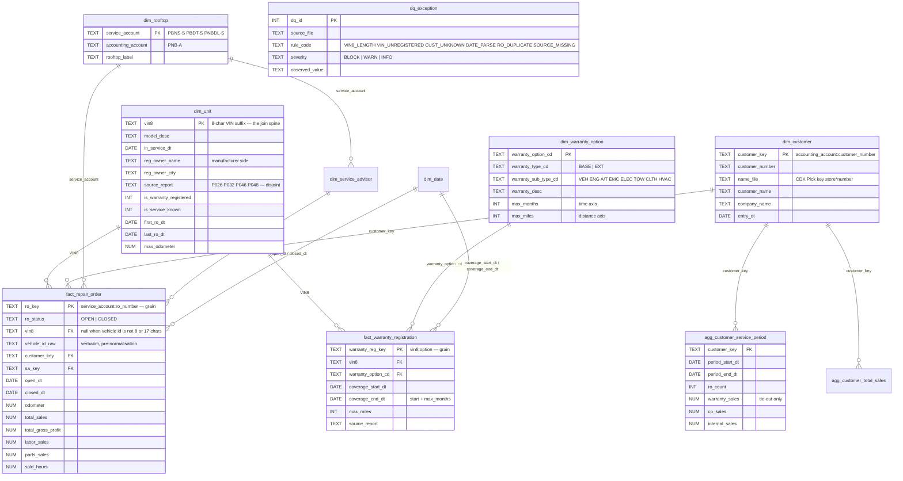
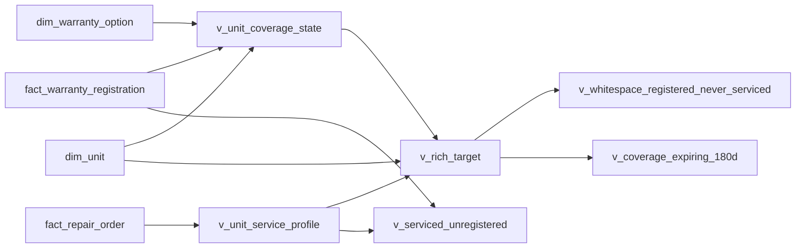

# Warranty GENE Warehouse Wireframe — ERD

Grain is declared on every fact. VIN8 is the cross-source spine; the customer number
(recovered from the CDK `NAME-FILE`) is the secondary spine.

## Mart lineage

